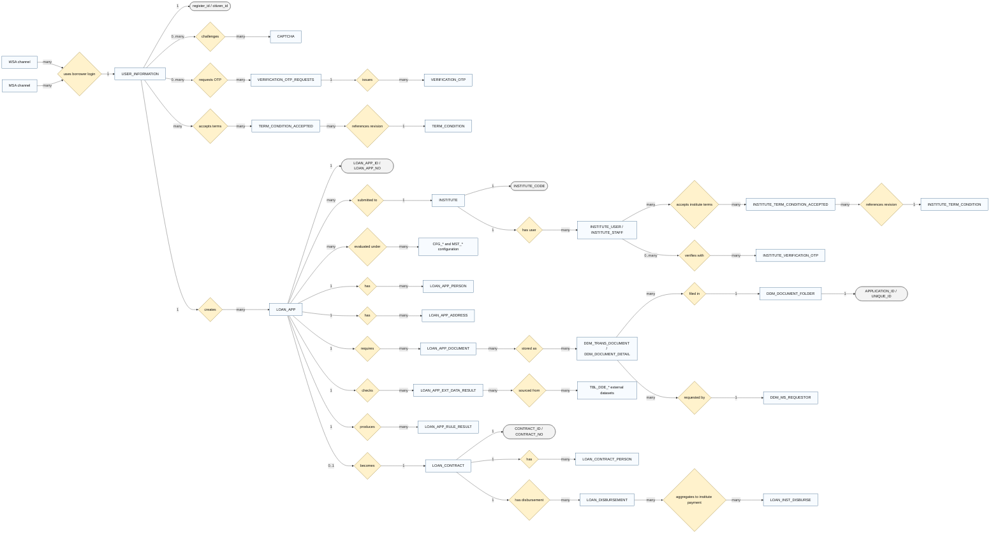
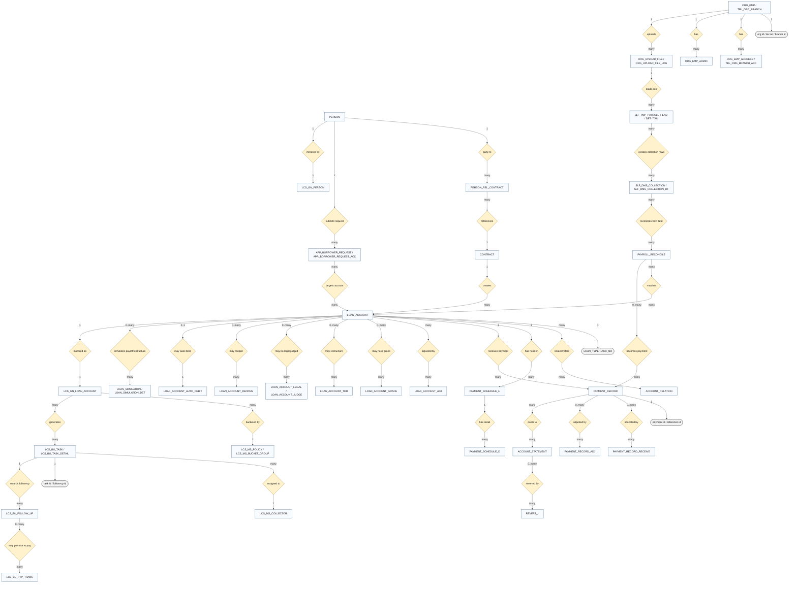
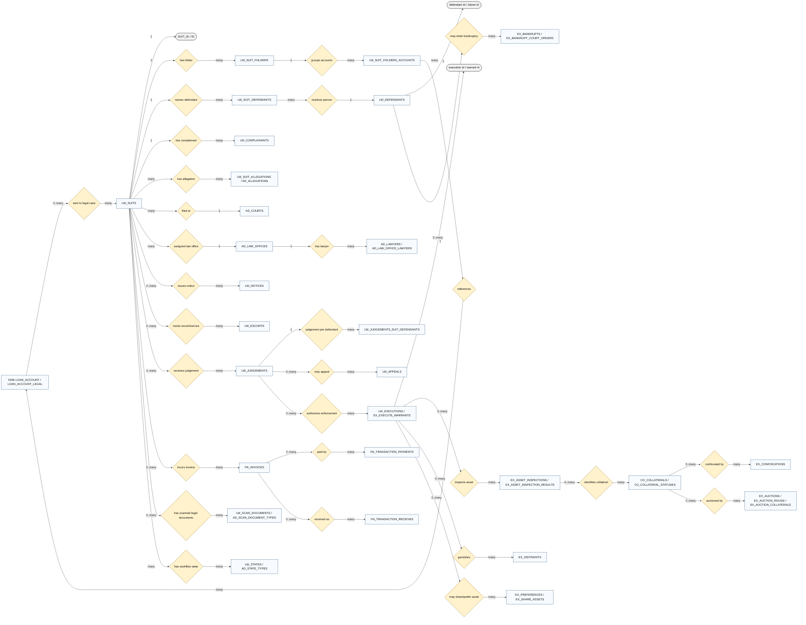
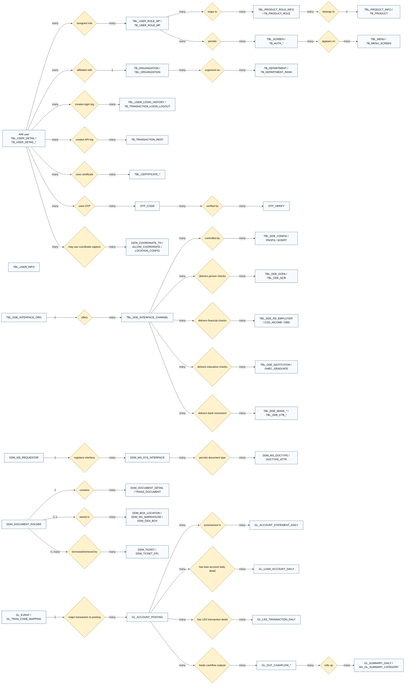

# DSL System Chen-Style ERD and Data Dictionary

Generated: 2026-06-28  
Workspace: `/Users/twotothepowerofseven/Downloads/เอกสารส่งมอบ DSL-V1.0`  

## Scope and Source Baseline

This report consolidates the DSL V1.0 deliverables under `deliverables/` into a coherent enterprise entity model. The source pass covered the final/late document families that carry ER, program flow, data dictionary, user design, business requirements, database operations, and flow overview evidence:

- `deliverables/งวดที่ 8 update/Documents งวดที่ 8 (ปรับปรุงเอกสาร)` for updated DMS BRD/UD/TD/DFD material.
- `deliverables/งวดที่ 8/แผ่น 1` for v4 BRD/UD/TD and program-flow/ER documents.
- `deliverables/งวดที่ 8/แผ่น 3/3.2_IMP_เอกสารคำอธิบายข้อมูลของระบบงาน` for v4 data dictionaries.
- `deliverables/งวดที่ 8/แผ่น 4/4.6_OPR_คู่มือระบบบริหารฐานข้อมูล` and `4.8_OPR_คู่มือการดูแลและการบริหารจัดการ Table ต่างๆ ในระบบ และการทำ HouseKeeping Data` for operational table handling.
- `deliverables/Flow-Overview` for cross-process flows.
- `deliverables/งวดที่ 8 update/Source Code` for source-code table references where the data dictionary is incomplete or inherited from earlier deliverables.

Important modeling rule: Mermaid does not provide a native Chen ER renderer. The diagrams below therefore use Mermaid `flowchart` syntax with Chen semantics:

- Rectangle-like nodes are entities.
- Diamond nodes are relationships.
- Rounded/oval-like nodes are attributes or key groups.
- Edge labels show cardinality and optionality.
- System boundary subgraphs are not Chen entities; they are used only to keep a very large model readable.

## 1. Enterprise DSL Lifecycle ERD

```mermaid
flowchart LR
  %% Chen-style legend:
  %% [Entity], {Relationship}, ([Attribute / key group])

  subgraph CH["Channels and identity"]
    WSA["WSA<br/>Web self-service channel"]
    MSA["MSA<br/>Mobile self-service channel"]
    AIM_USER["AIM user and role<br/>TBL_USER_DETAIL, TBL_USER_INFO"]
    RMS_USER["RMS registered user<br/>USER_INFORMATION"]
    INST_USER["Institute user<br/>INSTITUTE_USER, INSTITUTE_STAFF"]
    OTP["OTP / captcha / terms<br/>CAPTCHA, VERIFICATION_OTP, TERM_CONDITION"]
  end

  subgraph LOS["Loan origination and disbursement"]
    BORROWER["Borrower / student<br/>PERSON, LOAN_APP_PERSON, RMS_USER"]
    INSTITUTE["Institute<br/>INSTITUTE"]
    COURSE["Education program<br/>CFG_CURRICULUM, MST_EDUCATION_*"]
    LOAN_APP["Loan application<br/>LOAN_APP"]
    APP_PERSON["Application parties<br/>LOAN_APP_PERSON"]
    APP_ADDR["Application address<br/>LOAN_APP_ADDRESS"]
    APP_DOC["Application document<br/>LOAN_APP_DOCUMENT, DDM_DOCUMENT_DETAIL"]
    APP_EXT["External-data result<br/>LOAN_APP_EXT_DATA, LOAN_APP_EXT_DATA_RESULT, DDE_*"]
    RULE_RESULT["Eligibility and rule result<br/>LOAN_APP_RULE_RESULT"]
    CONTRACT["Loan contract<br/>LOAN_CONTRACT"]
    CONTRACT_PERSON["Contract parties<br/>LOAN_CONTRACT_PERSON"]
    DISBURSEMENT["Disbursement<br/>LOAN_DISBURSEMENT, LOAN_INST_DISBURSE"]
    REFUND["Refund / return<br/>LOAN_INST_REFUND, LOAN_STUDENT_REFUND"]
    BUDGET["Budget allocation<br/>LOAN_BUDGET, TRN_BUDGET_SPENDING"]
  end

  subgraph DMS["Debt management, DAM, employer deduction, payment"]
    LOAN_ACCOUNT["Debt account<br/>LOAN_ACCOUNT"]
    SCHEDULE["Repayment schedule<br/>PAYMENT_SCHEDULE_H/D"]
    PAYMENT["Payment record<br/>PAYMENT_RECORD, PAYMENT_RECORD_RECEIVE"]
    STATEMENT["Account statement<br/>ACCOUNT_STATEMENT"]
    ADJUSTMENT["Adjustment / reversal<br/>LOAN_ACCOUNT_ADJ, PAYMENT_RECORD_ADJ, REVERT_*"]
    BORR_REQ["Borrower servicing request<br/>APP_BORROWER_REQUEST"]
    SIMULATION["Loan simulation<br/>LOAN_SIMULATION, LOAN_SIMULATION_DET"]
    AUTO_DEBIT["Auto debit profile<br/>LOAN_ACCOUNT_AUTO_DEBIT"]
    EMPLOYER["Employer organization<br/>ORG_EMP, TBL_ORG_BRANCH"]
    PAYROLL_FILE["Payroll / deduction file<br/>ORG_UPLOAD_FILE, SLF_TMP_PAYROLL_*"]
    PAYROLL_RECON["Payroll reconcile<br/>PAYROLL_RECONCILE, SLF_DMS_COLLECTION"]
    LCS_TASK["Collection task<br/>LCS_BU_TASK, LCS_BU_TASK_DETAIL"]
    LCS_FOLLOW["Follow-up / PTP<br/>LCS_BU_FOLLOW_UP, LCS_BU_PTP_TRANS"]
  end

  subgraph LES["Litigation and enforcement"]
    SUIT["Legal suit<br/>LW_SUITS"]
    SUIT_FOLDER["Suit folder / accounts<br/>LW_SUIT_FOLDERS, LW_SUIT_FOLDERS_ACCOUNTS"]
    DEFENDANT["Defendant / complainant<br/>LW_SUIT_DEFENDANTS, LW_DEFENDANTS"]
    LAW_OFFICE["Law office and lawyer<br/>AD_LAW_OFFICES, AD_LAWYERS"]
    JUDGEMENT["Judgement<br/>LW_JUDGEMENTS"]
    EXECUTION["Execution warrant<br/>EX_EXECUTE_WARRANTS"]
    ASSET["Asset inspection / collateral<br/>EX_ASSET_INSPECTIONS, CO_COLLATERALS"]
    AUCTION["Auction / seizure / garnishment<br/>EX_AUCTIONS, EX_CONFISCATIONS, EX_DISTRAINTS"]
    LEGAL_FIN["Legal finance<br/>FN_INVOICES, FN_TRANSACTION_PAYMENTS, FN_TRANSACTION_RECEIVES"]
  end

  subgraph DOCINT["Document, external exchange, GL, analytics"]
    DDM_FOLDER["Digital document folder<br/>DDM_DOCUMENT_FOLDER"]
    DDM_DOC["Digital document item<br/>DDM_TRANS_DOCUMENT, DDM_DOCUMENT_DETAIL"]
    DDE_EXT["External data exchange<br/>TBL_DDE_DOPA, RD, NCB, DBD, IBANK, KTB"]
    ERP_GL["ERP / GL posting<br/>GL_ACCOUNT_POSTING, GL_LOAN_ACCOUNT_DAILY"]
    MIS_FACT["MIS/BI facts<br/>F_PAYMENT, F_DISBURSE, F_FOLLOW_UP"]
    MIS_DIM["MIS/BI dimensions<br/>D_PERSON, D_CONTRACT, D_INSTITUTE, D_PAYMENT_*"]
  end

  A_CIF(["CIF / CID / citizen id"])
  A_APPKEY(["LOAN_APP_ID / LOAN_APP_NO"])
  A_CONTRACTKEY(["CONTRACT_ID / CONTRACT_NO"])
  A_ACCKEY(["LOAN_TYPE + ACC_NO"])
  A_LEGALKEY(["SUIT_ID / folder id"])
  A_DOCREF(["APPLICATION_ID / CALLBACK_REF_ID / UNIQUE_ID"])

  RMS_USER -- "1" --> R_OWN_ID{"identifies"}
  BORROWER -- "1" --> R_OWN_ID
  R_OWN_ID -- "1" --> A_CIF

  WSA -- "many" --> R_LOGIN{"authenticates through"}
  MSA -- "many" --> R_LOGIN
  R_LOGIN -- "many" --> RMS_USER
  R_LOGIN -- "many" --> OTP
  AIM_USER -- "many" --> R_PRIV{"authorizes staff function"}
  R_PRIV -- "many" --> INST_USER

  BORROWER -- "1" --> R_SUBMIT{"submits"}
  R_SUBMIT -- "many" --> LOAN_APP
  LOAN_APP -- "many" --> R_STUDY{"studies at"}
  R_STUDY -- "1" --> INSTITUTE
  LOAN_APP -- "many" --> R_PROGRAM{"selects"}
  R_PROGRAM -- "1" --> COURSE
  LOAN_APP -- "1" --> A_APPKEY
  LOAN_APP -- "1" --> R_APP_PARTY{"has party"}
  R_APP_PARTY -- "many" --> APP_PERSON
  LOAN_APP -- "1" --> R_APP_ADDR{"has address"}
  R_APP_ADDR -- "many" --> APP_ADDR
  LOAN_APP -- "1" --> R_ATTACH{"attaches"}
  R_ATTACH -- "many" --> APP_DOC
  LOAN_APP -- "1" --> R_CHECK{"checked by"}
  R_CHECK -- "many" --> APP_EXT
  APP_EXT -- "many" --> R_EXT_SRC{"receives from"}
  R_EXT_SRC -- "many" --> DDE_EXT
  LOAN_APP -- "1" --> R_RULE{"evaluates"}
  R_RULE -- "many" --> RULE_RESULT
  LOAN_APP -- "0..1" --> R_APPROVE{"approved into"}
  R_APPROVE -- "1" --> CONTRACT
  CONTRACT -- "1" --> A_CONTRACTKEY
  CONTRACT -- "1" --> R_CONTRACT_PARTY{"binds party"}
  R_CONTRACT_PARTY -- "many" --> CONTRACT_PERSON
  CONTRACT -- "1" --> R_DISB{"authorizes"}
  R_DISB -- "many" --> DISBURSEMENT
  DISBURSEMENT -- "many" --> R_BUDGET{"consumes budget"}
  R_BUDGET -- "1" --> BUDGET
  DISBURSEMENT -- "0..many" --> R_REFUND{"may reverse via"}
  R_REFUND -- "many" --> REFUND

  CONTRACT -- "1" --> R_CREATE_ACC{"creates debt account"}
  R_CREATE_ACC -- "1..many" --> LOAN_ACCOUNT
  LOAN_ACCOUNT -- "1" --> A_ACCKEY
  LOAN_ACCOUNT -- "1" --> R_HAS_SCHED{"has schedule"}
  R_HAS_SCHED -- "many" --> SCHEDULE
  LOAN_ACCOUNT -- "1" --> R_PAYS{"receives"}
  R_PAYS -- "many" --> PAYMENT
  PAYMENT -- "many" --> R_POST{"posts"}
  R_POST -- "many" --> STATEMENT
  LOAN_ACCOUNT -- "1" --> R_ADJ{"is adjusted by"}
  R_ADJ -- "many" --> ADJUSTMENT
  BORROWER -- "1" --> R_SERVICE{"requests servicing"}
  R_SERVICE -- "many" --> BORR_REQ
  BORR_REQ -- "many" --> R_REQ_ACC{"changes"}
  R_REQ_ACC -- "1" --> LOAN_ACCOUNT
  LOAN_ACCOUNT -- "1" --> R_SIM{"can simulate"}
  R_SIM -- "many" --> SIMULATION
  LOAN_ACCOUNT -- "0..1" --> R_AUTO{"may enroll"}
  R_AUTO -- "1" --> AUTO_DEBIT

  EMPLOYER -- "1" --> R_UPLOAD{"uploads payroll"}
  R_UPLOAD -- "many" --> PAYROLL_FILE
  PAYROLL_FILE -- "1" --> R_RECON{"reconciles to"}
  R_RECON -- "many" --> PAYROLL_RECON
  PAYROLL_RECON -- "many" --> R_DEDUCT{"deducts from"}
  R_DEDUCT -- "many" --> LOAN_ACCOUNT

  LOAN_ACCOUNT -- "0..many" --> R_COLL{"generates collection task"}
  R_COLL -- "many" --> LCS_TASK
  LCS_TASK -- "1" --> R_FOLLOW{"records"}
  R_FOLLOW -- "many" --> LCS_FOLLOW

  LOAN_ACCOUNT -- "0..many" --> R_LEGAL{"escalates to litigation"}
  R_LEGAL -- "many" --> SUIT
  SUIT -- "1" --> A_LEGALKEY
  SUIT -- "1" --> R_FOLDER{"has folder"}
  R_FOLDER -- "many" --> SUIT_FOLDER
  SUIT -- "1" --> R_DEF{"has defendant"}
  R_DEF -- "many" --> DEFENDANT
  SUIT -- "many" --> R_LAWYER{"assigned to"}
  R_LAWYER -- "1" --> LAW_OFFICE
  SUIT -- "0..many" --> R_JUDGEMENT{"receives"}
  R_JUDGEMENT -- "many" --> JUDGEMENT
  JUDGEMENT -- "0..many" --> R_EXEC{"enforced by"}
  R_EXEC -- "many" --> EXECUTION
  EXECUTION -- "0..many" --> R_ASSET{"acts on"}
  R_ASSET -- "many" --> ASSET
  ASSET -- "0..many" --> R_AUCTION{"realized by"}
  R_AUCTION -- "many" --> AUCTION
  SUIT -- "0..many" --> R_LEGAL_FEE{"incurs"}
  R_LEGAL_FEE -- "many" --> LEGAL_FIN

  LOAN_APP -- "0..many" --> R_DOC1{"documents"}
  CONTRACT -- "0..many" --> R_DOC1
  LOAN_ACCOUNT -- "0..many" --> R_DOC1
  SUIT -- "0..many" --> R_DOC1
  R_DOC1 -- "many" --> DDM_FOLDER
  DDM_FOLDER -- "1" --> R_DOC2{"contains"}
  R_DOC2 -- "many" --> DDM_DOC
  DDM_DOC -- "1" --> A_DOCREF

  PAYMENT -- "many" --> R_GL1{"feeds accounting"}
  ADJUSTMENT -- "many" --> R_GL1
  DISBURSEMENT -- "many" --> R_GL1
  LEGAL_FIN -- "many" --> R_GL1
  R_GL1 -- "many" --> ERP_GL

  LOAN_APP -- "many" --> R_MART{"extracts to"}
  LOAN_ACCOUNT -- "many" --> R_MART
  PAYMENT -- "many" --> R_MART
  LCS_FOLLOW -- "many" --> R_MART
  DISBURSEMENT -- "many" --> R_MART
  R_MART -- "many" --> MIS_FACT
  MIS_FACT -- "many" --> R_DIM{"described by"}
  R_DIM -- "many" --> MIS_DIM

  classDef entity fill:#f7fbff,stroke:#1f4e79,stroke-width:1px,color:#111;
  classDef relationship fill:#fff2cc,stroke:#7f6000,stroke-width:1px,color:#111;
  classDef attribute fill:#f3f3f3,stroke:#666,stroke-width:1px,color:#111;
  class WSA,MSA,AIM_USER,RMS_USER,INST_USER,OTP,BORROWER,INSTITUTE,COURSE,LOAN_APP,APP_PERSON,APP_ADDR,APP_DOC,APP_EXT,RULE_RESULT,CONTRACT,CONTRACT_PERSON,DISBURSEMENT,REFUND,BUDGET,LOAN_ACCOUNT,SCHEDULE,PAYMENT,STATEMENT,ADJUSTMENT,BORR_REQ,SIMULATION,AUTO_DEBIT,EMPLOYER,PAYROLL_FILE,PAYROLL_RECON,LCS_TASK,LCS_FOLLOW,SUIT,SUIT_FOLDER,DEFENDANT,LAW_OFFICE,JUDGEMENT,EXECUTION,ASSET,AUCTION,LEGAL_FIN,DDM_FOLDER,DDM_DOC,DDE_EXT,ERP_GL,MIS_FACT,MIS_DIM entity;
  class R_OWN_ID,R_LOGIN,R_PRIV,R_SUBMIT,R_STUDY,R_PROGRAM,R_APP_PARTY,R_APP_ADDR,R_ATTACH,R_CHECK,R_EXT_SRC,R_RULE,R_APPROVE,R_CONTRACT_PARTY,R_DISB,R_BUDGET,R_REFUND,R_CREATE_ACC,R_HAS_SCHED,R_PAYS,R_POST,R_ADJ,R_SERVICE,R_REQ_ACC,R_SIM,R_AUTO,R_UPLOAD,R_RECON,R_DEDUCT,R_COLL,R_FOLLOW,R_LEGAL,R_FOLDER,R_DEF,R_LAWYER,R_JUDGEMENT,R_EXEC,R_ASSET,R_AUCTION,R_LEGAL_FEE,R_DOC1,R_DOC2,R_GL1,R_MART,R_DIM relationship;
  class A_CIF,A_APPKEY,A_CONTRACTKEY,A_ACCKEY,A_LEGALKEY,A_DOCREF attribute;
```

## 2. LOS, RMS, WSA, MSA, DDE, DDM Origination ERD

## 3. DMS, DAM, Employer Deduction, Payment, LCS ERD

## 4. LES Litigation and Enforcement ERD

## 5. Support Domain ERD: AIM, DDE, DDM, ERP, TrustedPath

## 6. MIS/BI Analytical Mart ERD

```mermaid
flowchart LR
  F_PAY["F_PAYMENT"]
  F_DISB["F_DISBURSE"]
  F_RETURN["F_RETURN"]
  F_FOLLOW["F_FOLLOW_UP"]
  D_PERSON["D_PERSON"]
  D_CONTRACT["D_CONTRACT"]
  D_REGISTER["D_REGISTER"]
  D_ADDR_CUR["D_ADDRESS_CURRENT"]
  D_ADDR_OFF["D_ADDRESS_OFFICE"]
  D_INVOICE["D_INVOICE"]
  D_SCHED["D_PAYMENT_SCHEDULE"]
  D_RECEIPT["D_RECEIPT"]
  D_PAY_CH["D_PAYMENT_CHANNEL"]
  D_PAY_METHOD["D_PAYMENT_METHOD"]
  D_ACC_STATUS["D_LOAN_ACCOUNT_STATUS"]
  D_LOAN_TYPE["D_LOAN_TYPE_INFO"]
  D_CLASS["D_LOAN_CLASSIFICATION"]
  D_ACC_DLY["D_LOAN_ACCOUNT_INFO_DLY"]
  D_ACC_MLY["D_LOAN_ACCOUNT_INFO_MLY"]
  D_INST["D_INSTITUTE / D_INSTITUTE_*"]
  D_EDU["D_EDUCATION_*"]
  D_APP_REQ["D_APP_BORROWER_REQUEST*"]
  D_COLLECTION["D_COLLECTION_PERSON / D_COLLECTION_ACCOUNT"]
  D_ACTIVITY["D_ACTIVITY / D_ACTIVITY_SUB"]
  D_COLLECTOR["D_COLLECTOR"]
  D_TASK["D_TASK / D_TASK_DETAIL"]
  D_BUCKET["D_BUCKET_GROUP / D_POLICY"]
  SMY_PAY["SMY_PAYMENT_MLY / RPT_PAYMENT"]
  SMY_PTP["SMY_PTP_MLY / SMY_FOLLOW_UP_MLY"]
  DM_CTRL["LOS_DATAMART_* / ETL control"]

  F_PAY -- "many" --> R_PAY_PERSON{"by person"}
  R_PAY_PERSON -- "1" --> D_PERSON
  F_PAY -- "many" --> R_PAY_CONTRACT{"for contract"}
  R_PAY_CONTRACT -- "1" --> D_CONTRACT
  F_PAY -- "many" --> R_PAY_INVOICE{"for invoice"}
  R_PAY_INVOICE -- "1" --> D_INVOICE
  F_PAY -- "many" --> R_PAY_SCHED{"against schedule"}
  R_PAY_SCHED -- "1" --> D_SCHED
  F_PAY -- "many" --> R_PAY_RECEIPT{"receipted as"}
  R_PAY_RECEIPT -- "1" --> D_RECEIPT
  F_PAY -- "many" --> R_PAY_CH{"paid through"}
  R_PAY_CH -- "1" --> D_PAY_CH
  F_PAY -- "many" --> R_PAY_METHOD{"uses method"}
  R_PAY_METHOD -- "1" --> D_PAY_METHOD
  F_PAY -- "many" --> R_ACC_STAT{"account status"}
  R_ACC_STAT -- "1" --> D_ACC_STATUS
  F_PAY -- "many" --> R_LOAN_TYPE{"loan type"}
  R_LOAN_TYPE -- "1" --> D_LOAN_TYPE
  F_PAY -- "many" --> R_CLASS{"classification"}
  R_CLASS -- "1" --> D_CLASS
  F_PAY -- "many" --> R_ACC_DLY{"daily account snapshot"}
  R_ACC_DLY -- "1" --> D_ACC_DLY
  D_ACC_DLY -- "many" --> R_ACC_MLY{"rolls into"}
  R_ACC_MLY -- "many" --> D_ACC_MLY

  F_DISB -- "many" --> R_DISB_PERSON{"for borrower"}
  R_DISB_PERSON -- "1" --> D_PERSON
  F_DISB -- "many" --> R_DISB_INST{"for institute"}
  R_DISB_INST -- "1" --> D_INST
  F_DISB -- "many" --> R_DISB_EDU{"for education"}
  R_DISB_EDU -- "1" --> D_EDU
  F_RETURN -- "many" --> R_RET_INST{"returned by institute/student"}
  R_RET_INST -- "1" --> D_INST
  F_RETURN -- "many" --> R_RET_PERSON{"returned for person"}
  R_RET_PERSON -- "1" --> D_PERSON

  F_FOLLOW -- "many" --> R_COL_PERSON{"collection person"}
  R_COL_PERSON -- "1" --> D_COLLECTION
  F_FOLLOW -- "many" --> R_ACTIVITY{"activity"}
  R_ACTIVITY -- "1" --> D_ACTIVITY
  F_FOLLOW -- "many" --> R_COLLECTOR{"collector"}
  R_COLLECTOR -- "1" --> D_COLLECTOR
  F_FOLLOW -- "many" --> R_TASK{"task"}
  R_TASK -- "1" --> D_TASK
  F_FOLLOW -- "many" --> R_BUCKET{"bucket/policy"}
  R_BUCKET -- "1" --> D_BUCKET

  D_PERSON -- "1" --> R_ADDRC{"has current address"}
  R_ADDRC -- "many" --> D_ADDR_CUR
  D_PERSON -- "1" --> R_ADDRO{"has office address"}
  R_ADDRO -- "many" --> D_ADDR_OFF
  D_PERSON -- "many" --> R_REGISTER{"has register"}
  R_REGISTER -- "many" --> D_REGISTER
  D_PERSON -- "many" --> R_REQ{"has service requests"}
  R_REQ -- "many" --> D_APP_REQ

  F_PAY -- "many" --> R_SMY_PAY{"summarized into"}
  R_SMY_PAY -- "many" --> SMY_PAY
  F_FOLLOW -- "many" --> R_SMY_PTP{"summarized into"}
  R_SMY_PTP -- "many" --> SMY_PTP
  F_PAY -- "many" --> R_ETL{"loaded by"}
  F_DISB -- "many" --> R_ETL
  F_FOLLOW -- "many" --> R_ETL
  R_ETL -- "many" --> DM_CTRL

  classDef entity fill:#f7fbff,stroke:#1f4e79,stroke-width:1px,color:#111;
  classDef relationship fill:#fff2cc,stroke:#7f6000,stroke-width:1px,color:#111;
  class F_PAY,F_DISB,F_RETURN,F_FOLLOW,D_PERSON,D_CONTRACT,D_REGISTER,D_ADDR_CUR,D_ADDR_OFF,D_INVOICE,D_SCHED,D_RECEIPT,D_PAY_CH,D_PAY_METHOD,D_ACC_STATUS,D_LOAN_TYPE,D_CLASS,D_ACC_DLY,D_ACC_MLY,D_INST,D_EDU,D_APP_REQ,D_COLLECTION,D_ACTIVITY,D_COLLECTOR,D_TASK,D_BUCKET,SMY_PAY,SMY_PTP,DM_CTRL entity;
  class R_PAY_PERSON,R_PAY_CONTRACT,R_PAY_INVOICE,R_PAY_SCHED,R_PAY_RECEIPT,R_PAY_CH,R_PAY_METHOD,R_ACC_STAT,R_LOAN_TYPE,R_CLASS,R_ACC_DLY,R_ACC_MLY,R_DISB_PERSON,R_DISB_INST,R_DISB_EDU,R_RET_INST,R_RET_PERSON,R_COL_PERSON,R_ACTIVITY,R_COLLECTOR,R_TASK,R_BUCKET,R_ADDRC,R_ADDRO,R_REGISTER,R_REQ,R_SMY_PAY,R_SMY_PTP,R_ETL relationship;
```

## 7. Source-Backed Data Dictionary Anchors

The following dictionary is intentionally compressed to the entity/relationship level. It preserves the table names and key fields needed to understand the ERD without reproducing every vendor column verbatim.

### 7.1 LOS and Origination

| Table family | Main keys | Core attributes | Relationship role |
|---|---|---|---|
| `INSTITUTE` | `INSTITUTE_CODE` | Thai/English institute name, title, institute type/subtype, ministry/affiliation, education zone, address/contact, `MOU_NO`, `MOU_COMPLETE_DATE`, `EDUCATION_TYPE_CODE`, `ACTIVE_FLAG`, create/update audit | Master institute entity used by applications, contracts, disbursement, institute staff, education calendar, and refund flows. |
| `INSTITUTE_USER`, `INSTITUTE_STAFF` | user/staff id, `INSTITUTE_CODE` | account/contact, role/function, active/audit fields | Institute-side actors for loan application verification and institute workflows. |
| `INSTITUTE_BANK_ACCOUNT`, `INSTITUTE_DOCUMENT`, `INSTITUTE_EDU_CALENDAR`, `INSTITUTE_EDU_LV` | institute code plus sequence/config key | bank account, document, academic calendar, education-level mapping | Child configuration and evidence entities under `INSTITUTE`. |
| `CFG_*` | config-specific code | campaign, auto approve, control parameter, cost of living, credit scoring, curriculum, document, external data, institute, loan period, loan rule, product and skillset rules | Configuration dimensions used by `LOAN_APP` and eligibility/rule processing. |
| `MST_*` | master code | app status, class year, document type, education level/sub-level, external data, faculty, income type, institute type, loan rule, personal status, refund status, SLF bank account | Reference dimensions for LOS transaction status and classification. |
| `LOAN_APP` | `LOAN_APP_ID`, `LOAN_APP_NO` | `APP_STATUS_CODE`, submit/approve dates, `INSTITUTE_CODE`, new-borrower flag, academic year, semester, education level/sub-level, product/curriculum/faculty/program, GPA, credit score, rule summary, current user, approval result, income and verification flags | Central origination application entity. |
| `LOAN_APP_PERSON` | application/person key | borrower/guarantor/related-person role, identity, relationship, personal status | Multi-party child entity of `LOAN_APP`. |
| `LOAN_APP_ADDRESS` | application/address key | address type, province/district/subdistrict/postcode, contact fields | Address child entity of `LOAN_APP`. |
| `LOAN_APP_DOCUMENT` | application/document key | document type, status, upload/reference fields | LOS document checklist; links naturally to DDM by application/document reference. |
| `LOAN_APP_EXT_DATA`, `LOAN_APP_EXT_DATA_RESULT` | application/external-data key | external source, request/result, status, error/remark, created/updated fields | Captures DDE/external validation results such as DOPA, NCB, RD, DBD, education and bank checks. |
| `LOAN_APP_RULE_RESULT` | application/rule key | rule code, pass/fail, score/result detail, message | Eligibility/approval rule output for `LOAN_APP`. |
| `LOAN_APP_HISTORY` | application/history key | status, action, actor, timestamp, remark | Audit/history for application workflow. |
| `LOAN_CONTRACT` | `CONTRACT_ID`, `CONTRACT_NO` | `LOAN_APP_ID`, academic year, semester, institute, education level, borrower bank account, sign type, contract type, contract status, active flag, complete/submit dates, guarantor/MOI flags | Approved contract entity derived from `LOAN_APP`. |
| `LOAN_CONTRACT_PERSON` | contract/person key | borrower/guarantor/related person identity and role | Contract party child entity. |
| `LOAN_CONTRACT_DOCUMENT`, `LOAN_CONTRACT_EDU_STATUS` | contract child key | contract evidence and education status tracking | Contract document/evidence and education progression. |
| `LOAN_DISBURSEMENT` | disbursement id/key | contract/application/institute/student amount fields, status, dates, bank/account fields | Transaction entity for payment of approved loan amounts. |
| `LOAN_INST_DISBURSE` | institute-disbursement id/key | institute-level payment batch/status/amount | Aggregates borrower-level disbursement to institute transfer. |
| `LOAN_INST_REFUND`, `LOAN_STUDENT_REFUND` | refund id/key | refund amount/status/reason/date/reference | Refund/reversal of disbursement at institute or student level. |
| `LOAN_BUDGET`, `TRN_BUDGET_SPENDING` | budget key | fiscal/academic year, product/category, allocated and consumed amount | Budget control and budget-consumption relationship for disbursements. |

### 7.2 DMS, DAM, Payment, Employer Deduction, LCS

| Table family | Main keys | Core attributes | Relationship role |
|---|---|---|---|
| `PERSON` | `CIF`/person id, often citizen id | name, identity, demographic/contact fields, status | DMS debtor/party entity. |
| `CONTRACT` | contract key/no | contract number, borrower/institute/application refs, dates, status | DMS contract anchor for debt accounts. |
| `PERSON_REL_CONTRACT` | person-contract relation key | relationship type and party role | Resolves many parties to contracts. |
| `LOAN_ACCOUNT` | `LOAN_TYPE`, `ACC_NO` | account no/type, contract/person refs, principal/interest/fee/late-charge balance, statuses, classification, fund/year/semester/institute/register refs, create/update audit | Central DAM/DMS debt-account entity. |
| `ACCOUNT_RELATION` | `LOAN_TYPE`, `ACC_NO`, `REF_LOAN_TYPE`, `REF_ACC_NO` | transaction date, remark, audit | Relates accounts to prior/ref accounts, consolidation, migration, or reopened account chains. |
| `ACCOUNT_STATEMENT` | `LOAN_TYPE`, `ACC_NO`, `TRAN_DATE`, `SEQ_NO` | statement id, post/reference ids, transaction type/code/source/flag, branch/payment channel/reference, transaction amount, principal, interest groups, late charge, fees, fund/year/semester/institute/register, active flag, audit, date-time fields | Ledger-like account movement table. |
| `PAYMENT_RECORD` | payment/receipt/reference key | payment channel/method, amount, effective/posting dates, account/person refs, status/source/audit | Main payment transaction from online/offline/SIM/payroll/auto-debit paths. |
| `PAYMENT_RECORD_RECEIVE` | payment allocation key | component allocation to principal/interest/late charge/fees, account schedule refs | Payment allocation detail. |
| `PAYMENT_RECORD_ADJ` | adjustment key | old/new amounts, reason/status, approval/audit | Payment correction entity. |
| `PAYMENT_SCHEDULE_H`, `PAYMENT_SCHEDULE_D` | schedule header/detail keys, account key | due dates, period, principal, interest, late-charge, remaining balance, status | Repayment schedule header/detail. |
| `LOAN_ACCOUNT_ADJ` | account adjustment key | adjustment type, reason, component amounts, approve/post status, audit | Account-balance correction. |
| `REVERT_*` | revert key | source transaction, old/new component values, user/date/reason | Reversal family for statements/payments/account effects. |
| `LOAN_ACCOUNT_GRACE` | account/grace key | grace type, start/end, reason/status | Grace-period/payment-condition change. |
| `LOAN_ACCOUNT_TDR` | account/TDR key | restructuring terms, schedule result, status | Troubled debt restructuring / debt restructure entity. |
| `LOAN_ACCOUNT_LEGAL`, `LOAN_ACCOUNT_JUDGE`, `LOAN_ACCOUNT_JUDGE_DET` | account/legal/judge key | legal status, judgement result, judgement amount/detail | DMS legal/judgement markers and LES bridge. |
| `LOAN_ACCOUNT_REOPEN`, `LOAN_ACCOUNT_CREATE` | process key | create/reopen request state and audit | Account creation/reopen operational records. |
| `LOAN_ACCOUNT_AUTO_DEBIT` | account/bank/debit profile key | bank/account, active flag, effective date, retry/status fields | Auto-debit enrollment for repayment collection. |
| `LOAN_SIMULATION`, `LOAN_SIMULATION_DET` | simulation header/detail key | payoff/restructure scenario, calculation date, projected component amounts | Calculation/simulation side records for account servicing. |
| `APP_BORROWER_REQUEST` | `REQUEST_APP_NO` | application/request type, channel, request type/topic, CIF, application/dead/lost dates, relation/contact/address fields, status, create/verify/review/approve audit | Borrower servicing request header. |
| `APP_BORROWER_REQUEST_ACC` | request-account key | request app no, account key, requested changes | Request-to-account line detail. |
| `ORG_EMP`, `ORG_EMP_ADDRESS`, `ORG_EMP_ADMIN` | employer id/tax no/admin key | employer organization, addresses, admin users/contacts/status | Employer organization and authorized users. |
| `TBL_ORG_BRANCH`, `TBL_ORG_BRANCH_ACC`, `TBL_ORG_BRANCH_ACC_HIS` | org branch/account key | branch and bank-account profile/history | Employer branch/account master. |
| `ORG_UPLOAD_FILE`, `ORG_UPLOAD_FILE_LOG` | upload file id | file name, source, upload status, counts, error/log detail, audit | Employer file intake. |
| `SLF_TMP_PAYROLL_HEAD`, `SLF_TMP_PAYROLL_DET`, `SLF_TMP_PAYROLL_TAIL` | payroll file/row key | header/control/detail/trailer rows from employer file | Staging for employer payroll deduction files. |
| `SLF_DMS_COLLECTION`, `SLF_DMS_COLLECTION_DT` | collection header/detail key | payroll deduction collection batch and per-account detail | Creates/matches collection against DMS accounts. |
| `PAYROLL_RECONCILE` | reconcile id/key | employer/payroll/payment/account refs, matched amount/status/error | Reconciliation between employer deduction and DMS debt/payment. |
| `TMP_CSV_IMPORT_FILE`, `PAYROLL_BATCH_FAILED_LOG` | temp/batch/error key | imported file row, parse status, error detail | Operational staging and error handling. |
| `LCS_GN_PERSON`, `LCS_GN_LOAN_ACCOUNT`, `LCS_GN_LOAN_ACCOUNT_PERSON` | LCS person/account keys | collection-ready debtor/account mirror | Collection-domain copy/working set for DMS accounts. |
| `LCS_BU_TASK`, `LCS_BU_TASK_DETAIL` | task/detail key | assignment, account/person, due/action/status | Collection work item. |
| `LCS_BU_FOLLOW_UP`, `LCS_BU_PTP_TRANS` | follow-up/PTP key | contact activity, outcome, promise-to-pay amount/date/status | Collection history and commitment. |
| `LCS_MS_BUCKET_GROUP`, `LCS_MS_POLICY`, `LCS_MS_COLLECTOR` | master keys | bucket policy, collector, assignment rules | Collection master configuration. |

### 7.3 LES

| Table family | Main keys | Core attributes | Relationship role |
|---|---|---|---|
| `AD_*` control tables | mostly `ID` | court, allegation, law office, lawyer, state, document type, judgement-order, land office/type, organization, officer, condition masters; common `VERSION`, created/updated audit, active flag | LES reference/master configuration. |
| `LW_SUITS` | `ID`/suit id | suit no/type/status, court, law office, date/status/audit | Central lawsuit entity. |
| `LW_SUIT_FOLDERS`, `LW_SUIT_FOLDERS_ACCOUNTS` | folder/account key | suit folder and DMS account references | Groups debt accounts under legal folder/case. |
| `LW_SUIT_DEFENDANTS`, `LW_DEFENDANTS`, `LW_COMPLAINANTS` | defendant/complainant keys | party identity and legal role | Legal parties. |
| `LW_SUIT_ALLEGATIONS`, `AD_ALLEGATIONS` | allegation key | allegation type and relation to suit type | Legal claim/allegation detail. |
| `LW_SUIT_LAWYERS`, `AD_LAW_OFFICES`, `AD_LAWYERS`, `AD_LAW_OFFICE_LAWYERS` | lawyer/law-office keys | assignment and law-office structure | Legal representation. |
| `LW_NOTICES`, `LW_ESCORTS` | notice/escort keys | service notice and service-of-process tracking | Pre-judgement legal process tracking. |
| `LW_JUDGEMENTS`, `LW_JUDGEMENTS_SUIT_DEFENDANTS` | judgement keys | judgement result, amount, order/date, per-defendant outcome | Court judgement entity. |
| `LW_EXECUTIONS`, `EX_EXECUTE_WARRANTS` | execution/warrant keys | execution case, warrant info, dates/status | Enforcement initiation after judgement. |
| `EX_ASSET_INSPECTIONS`, `EX_ASSET_INSPECTION_RESULTS` | inspection keys | asset check request/result | Asset discovery. |
| `CO_COLLATERALS`, `CO_COLLATERAL_STATUSES` | collateral key | asset/collateral attributes and status | Assets subject to enforcement. |
| `EX_CONFISCATIONS`, `EX_DISTRAINTS` | confiscation/garnishment key | seizure/garnishment actions and status | Enforcement action. |
| `EX_AUCTIONS`, `EX_AUCTION_ROUND`, `EX_AUCTION_COLLATERALS` | auction keys | auction rounds, collateral and realized amount/status | Asset realization. |
| `EX_BANKRUPTS`, `EX_BANKRUPT_COURT_ORDERS`, `EX_COMPLAINTS`, `EX_PREFERENCES`, `EX_SHARE_ASSETS` | process keys | bankruptcy, complaint, preference, asset share data | Specialized enforcement/legal processes. |
| `FN_INVOICES`, `FN_TRANSACTION_PAYMENTS`, `FN_TRANSACTION_RECEIVES` | finance transaction keys | invoice, payment, receipt, amount/status/date | LES legal fee and financial transaction tracking. |
| `LW_SCAN_DOCUMENTS` | document key | scan document type/status/path/ref | LES scanned-document evidence. |
| `LW_STATES` | state/workflow key | process state/status/history | LES workflow state tracking. |

### 7.4 DDM

| Table family | Main keys | Core attributes | Relationship role |
|---|---|---|---|
| `DDM_MS_DOCTYPE` | `RUNNING_NO`, `DOCTYPE` | document type, name, allowed extensions, audit | Master document type. |
| `DDM_MS_DOCTYPE_ATTR` | `RUNNING_NO` | attribute name/description | Document metadata attribute definition. |
| `DDM_MS_EXT_FILETYPE` | `RUNNING_NO`, extension | extension, MIME type, description | Allowed file type master. |
| `DDM_MS_REQUESTOR` | `SYSTEM_NAME`, `SYSTEM_ID` | requestor system, description, callback URL, audit | Registers LOS/DMS/LES/other DSL systems that store documents. |
| `DDM_MS_SEARCH` | `SYSTEM_NAME`, `KEY_SEARCH` | search key and description | System-specific document search metadata. |
| `DDM_MS_SYS_INTERFACE` | `RUNNING_NO` | system, doctype, function, hard-copy flag, warehouse code | Which system/function can use which document type. |
| `DDM_TRANS_DOCUMENT` | `RUNNING_NO`, `UNIQUE_ID` | system, doctype, callback ref, doc version, file paths/names, application id, CLOB data attributes, citizen id/name, label doc | Digital document transaction/item. |
| `DDM_DOCUMENT_FOLDER` | `RUNNING_NO`, `FOLDER_NO` | CIF, CID, application id, source system, status, group code, institute, academic year/semester, contract no/date, loan account no, register no, box no | Logical folder for a borrower/application/contract/account document set. |
| `DDM_DOCUMENT_DETAIL` | `RUNNING_NO`, `UNIQUE_ID` | doctype, label, version, page count, status, application id, folder no, hardcopy flag | Document item within folder. |
| `DDM_DOCUMENT_STATUS` | `STATUS_CODE` | status name/group, active flag, order | Document workflow status. |
| `DDM_BOX_LOCATION`, `DDM_MS_WAREHOUSE`, `DDM_GEN_BOX` | box/warehouse keys | warehouse, physical location, box status | Physical hard-copy storage location. |
| `DDM_FOLDER_CTR`, `DDM_SO_CTR` | control-note keys | folder control/deposit note | Hard-copy transfer/control records. |
| `DDM_TICKET`, `DDM_TICKET_DTL` | ticket/detail key | borrow/retrieve approval and requested folder details | Physical document borrow/retrieval workflow. |
| `DDM_MS_ROLE`, `DDM_MS_ROLE_DOCGROUP`, `DDM_MS_ROLE_DUTY`, `DDM_MS_USER_TYPE` | role/user-type keys | role, doc group, duty, AIM user-type mapping | Document access control. |

### 7.5 DDE

| Table family | Main keys | Core attributes | Relationship role |
|---|---|---|---|
| `TBL_DDE_DOPA` | interface/request key | citizen/person response payload/status/date | Department of Provincial Administration identity data. |
| `TBL_DDE_RD_EMPLOYER`, `TBL_DDE_CGD_INCOME`, `TBL_DDE_DBD` | interface/request key | employer, income, business registration response payload/status/date | Income/employer/legal-entity checks. |
| `TBL_DDE_INSTITUTION`, `TBL_DDE_OHEC_GRADUATE` | interface/request key | institute and graduate/education response payload/status/date | Education/institute external data. |
| `TBL_DDE_NBTC` | interface/request key | telecom/contact verification payload/status/date | Contact validation. |
| `TBL_DDE_IBANK_TRANSFER`, `TBL_DDE_IBANK_DEPOSIT`, `TBL_DDE_KTB_TRANSFER`, `TBL_DDE_KTB_DEPOSIT` | interface/request key | bank transfer/deposit movement payload/status/date | Banking data exchange. |
| `TBL_DDE_NCB` | interface/request key | credit bureau request/result/status/date | NCB validation. |
| `TBL_DDE_DATE_EXPISE` | interface/request key | excise/date payload/status | Specialized external exchange. |
| `TBL_DDE_CONFIG`, `TBL_DDE_PROPS`, `TBL_DDE_SCRIPT` | config key | interface configuration, properties, scripts | DDE runtime/configuration. |
| `TBL_DDE_INTERFACE_CHANNEL`, `TBL_DDE_INTERFACE_ORG` | channel/org key | interface organization and channel metadata | DDE interface registry. |

### 7.6 AIM, TrustedPath, CTA/CAM/MDA

| Table family | Main keys | Core attributes | Relationship role |
|---|---|---|---|
| `TBL_USER_DETAIL`, `TBL_USER_INFO`, `TBL_USER_DETAIL_TMP`, `TB_USER_DETAIL_*` | user id / staff/student/contractor key | user identity, type, contact, status, Keycloak/group refs, audit | DSL staff/internal/external user master. |
| `TBL_USER_GROUP`, `TB_USER_GROUP_KEYCLOAK` | group key | user group and Keycloak group mapping | Grouping for authorization. |
| `TBL_USER_ROLE_MP`, `TB_USER_ROLE_MP`, `TBL_PRODUCT_ROLE_MP`, `TB_AUTH_ROLE_*` | role mapping keys | user-role, product-role, screen/url/permission mapping | Authorization bridge tables. |
| `TBL_PRODUCT_INFO`, `TB_PRODUCT`, `TBL_PRODUCT_ROLE_INFO`, `TB_PRODUCT_ROLE`, `TB_PRODUCT_ROLE_GROUP` | product/role keys | DSL product/system and role groups | Product/system-level access model. |
| `TBL_MENU`, `TBL_MENU_PERMISSION`, `TBL_SCREEN`, `TB_MENU_SCREEN`, `TB_AUTH_SCREEN_*` | menu/screen keys | menu, screen, URL, permission | UI/function entitlement model. |
| `TB_ORGANIZATION`, `TBL_ORGANIZATION`, `TB_DEPARTMENT`, `TB_DEPARTMENT_RANK`, `TBL_RESPONSE_UNIT*` | org/dept/unit keys | organization, response unit, department/rank hierarchy | Staff organization hierarchy. |
| `TBL_USER_LOCK`, `TBL_USER_LOCK_HISTORY`, `TBL_USER_LOGIN_HISTORY`, `TB_TRANSACTION_LOGIN_LOGOUT`, `TB_TRANSACTION_REST`, `TB_TRANSACTION_USER_LOCK` | log/transaction keys | login/logout, REST call, lock/unlock activity | AIM audit and security logging. |
| `TBL_CERTIFICATE_DIGITAL_SIGN`, `TBL_CERTIFICATE_MOBILE`, `TBL_CERTIFICATE_WEB_SERVER`, `TBL_CERT_DIGITAL_SIGN_DSL` | certificate key | certificate subject, serial, effective/expiry, path/status | Certificate management for signing/mobile/web-server trust. |
| `OTP_CODE`, `OTP_VERIFY` | OTP key/reference | OTP code/reference, channel, expiry, verify result | OTP issuance and verification. |
| `DATA_COORDINATE_TH`, `ALLOW_COORDINATE`, `LOCATION_CONFIG` | coordinate/config key | coordinate capture/allowance/location config | TrustedPath/CTA-CAM-MDA coordinate/location support. |

### 7.7 ERP and GL

| Table family | Main keys | Core attributes | Relationship role |
|---|---|---|---|
| `GL_ACCOUNT_POSTING`, `GL_ACCOUNT_POSTING_HIST`, `GL_ACCOUNT_POSTING_HIST_TEMP`, `GL_ACCOUNT_POSTING_HIST_TEST` | posting id/key | event, account, amount, debit/credit, source transaction, posting date/status | Accounting posting transaction and history. |
| `GL_ACCOUNT_STATEMENT_DAILY`, `GL_ACCOUNT_STATEMENT_DAILY_HIS` | account/date key | daily statement summary and history | Daily accounting statement. |
| `GL_LOAN_ACCOUNT_DAILY`, `GL_LOAN_ACCOUNT_DAILY_HIS` | loan account/date key | loan-account daily financial components | Daily loan-account GL snapshot. |
| `GL_LES_TRANSACTION_DALY`, `GL_LES_TRANSACTION_DALY_HIS` | LES transaction/date key | LES legal-finance transaction details | LES financial feed to GL. |
| `GL_DSL_ERP_FILE_OUT`, `GL_DSL_ERP_FILE_OUT_HIS` | file/output key | outbound file metadata/status/history | DSL-to-ERP file output. |
| `GL_EVENT`, `GL_TRAN_CODE_MAPPING` | event/mapping key | business event, transaction-code mapping | Maps DMS/LES/payment events to GL posting logic. |
| `GL_M_ACCOUNT`, `GL_M_CATEGORY`, `GL_M_PAYMENT_SOURCE`, `GL_M_TOKEN`, `GL_SCHEMA`, `GL_LOCATION_CONFIG` | master keys | account/category/source/token/schema/location config | GL master configuration. |
| `GL_OUT_CASHFLOW_*` | output/cashflow key | normal transaction, accrued interest, late charge, summary/workaround logs | Cashflow extraction/output family. |
| `GL_SUMMARY_ADJUST`, `GL_SUMMARY_DAILY`, `GL_SUMMARY_HIST`, `MV_GL_SUMMARY_CATEGORY` | summary keys | daily/category/historical GL summaries | GL reporting and reconciliation. |
| `ALL_TRANS`, `GL_COMP_TOK_ACC`, `GL_LOG_MASTER`, `GL_LOG_DERTAIL`, `GL_TMP_ACCOUNT_NO` | operational keys | all transactions, token/account comparison, logs, temporary account no | Supporting GL operation and troubleshooting tables. |

### 7.8 MIS/BI

| Table family | Main keys | Core attributes | Relationship role |
|---|---|---|---|
| `F_PAYMENT` | payment fact key | payment amount, date, account/person/contract/invoice/channel/status refs | Repayment/payment fact. |
| `F_DISBURSE` | disbursement fact key | disbursement amount/date, borrower, institute, education refs | LOS disbursement fact. |
| `F_RETURN` | return/refund fact key | return amount/date/status, person/institute refs | Refund/return fact. |
| `F_FOLLOW_UP` | follow-up fact key | collection activity, outcome, PTP, collector/task/account refs | LCS collection fact. |
| `D_PERSON`, `D_CONTRACT`, `D_REGISTER`, `D_ADDRESS_CURRENT`, `D_ADDRESS_OFFICE` | dimension keys | person, contract, register and address attributes | Core DMS/LOS dimensions. |
| `D_PAYMENT_CHANNEL`, `D_PAYMENT_METHOD`, `D_INVOICE`, `D_PAYMENT_SCHEDULE`, `D_RECEIPT`, `D_INVOICE_STATUS` | dimension keys | payment channel/method/invoice/schedule/receipt/status | Payment dimensions. |
| `D_LOAN_ACCOUNT_STATUS`, `D_LOAN_TYPE_INFO`, `D_LOAN_CLASSIFICATION`, `D_LOAN_ACCOUNT_INFO_DLY`, `D_LOAN_ACCOUNT_INFO_MLY` | dimension/snapshot keys | account state and loan classification snapshots | Debt-account analysis dimensions. |
| `D_INSTITUTE*`, `D_EDUCATION*` | dimension keys | institute and education attributes | Origination/disbursement analysis. |
| `D_APP_BORROWER_REQUEST*`, `D_REQUEST_TOPIC` | dimension keys | borrower request and topic attributes | Borrower service analytics. |
| `D_COLLECTION_PERSON`, `D_COLLECTION_ACCOUNT`, `D_ACTIVITY`, `D_ACTIVITY_SUB`, `D_RISK_LEVEL`, `D_PTP`, `D_COLLECTOR`, `D_TASK`, `D_TASK_DETAIL`, `D_BUCKET_GROUP`, `D_POLICY`, `D_LCS_ADDRESS` | dimension keys | collection/LCS dimensions | Collection follow-up analytics. |
| `SMY_PAYMENT_MLY`, `RPT_PAYMENT`, `SMY_PTP_MLY`, `SMY_FOLLOW_UP_MLY` | summary/report keys | pre-aggregated monthly/report measures | Reporting/BI presentation layer. |
| `LOS_DATAMART_*` | process/control keys | ETL/datamart control metadata | Datamart load and control tables. |

## 8. Replacement Data Dictionary for Missing or Incomplete KTB Deliverables

The entries below are not asserted as complete vendor dictionaries. They are coherent replacement dictionaries built from the deliverable references, source-code table handles, operational manuals, and cross-system flow context where the KTB package either references a table without a sufficient dictionary or points to earlier deliverables instead of repeating the dictionary.

### 8.1 WSA and MSA Channel Data

KTB deliverables describe WSA/MSA as borrower-facing channels/presentation tiers. The model should not invent a standalone WSA/MSA transactional database when the documented flows route to RMS, LOS, DMS, payment APIs, DDM, and external services.

| Logical entity | Replacement dictionary | Correct relationship |
|---|---|---|
| `WSA_CHANNEL` | Non-physical logical channel. Attributes: channel code `WSA`, web route/menu, authenticated RMS user, function code such as payment check/account statement/history, request timestamp, upstream service target. | Reads/writes through RMS for identity, LOS for origination, DMS/payment services for account/payment history, DDM for documents. |
| `MSA_CHANNEL` | Non-physical logical channel. Attributes: channel code `MSA`, mobile route/menu, authenticated RMS user, function code, request timestamp, upstream service target. | Same data ownership pattern as WSA. |
| `PAYMENT_CHECK` | Menu/function constant rather than a source-backed standalone table in the extracted dictionaries. Suggested audit attributes if materialized: function code, user/register id, account key, request timestamp, response status, upstream payment service reference. | DMS/payment-account query function against `LOAN_ACCOUNT`, `PAYMENT_RECORD`, `ACCOUNT_STATEMENT`, and payment APIs. |
| `PAYMENT_ACCOUNT_STATEMENT_HISTORY` | Menu/function constant rather than a source-backed standalone table in the extracted dictionaries. Suggested audit attributes if materialized: function code, user/register id, account key, date range, request timestamp, response status. | DMS statement-history query against `ACCOUNT_STATEMENT` and related payment records. |

### 8.2 RMS Tables Whose Detailed Dictionary Is Inherited or Thin

Physical names appear in lower-case in the RMS dictionary and upper-case in Java/JPA/source references. Use the physical naming convention of the deployed database, but keep these as the canonical logical fields.

| Table | Suggested key | Replacement fields | Relationship role |
|---|---|---|---|
| `USER_INFORMATION` | `REGISTER_ID`; alternate `CITIZEN_ID`, `LDAP_ID` | `REGISTER_ID`, `LDAP_ID`, `CITIZEN_ID`, `TITLE`, `FIRST_NAME`, `LAST_NAME`, `BIRTHDAY`, `EMAIL`, `MOBILE_NO`, `LINE_ID`, `ACTIVATED`, `ACTIVE`, create/update audit if present | Borrower/user registration master for WSA/MSA and RMS. |
| `CAPTCHA` | `REFERENCE_ID` | `REFERENCE_ID`, `ANSWER`, `CREATE_DATE`, expiry/status if present | Captcha challenge for registration/login/verification. |
| `VERIFICATION_USER` | `ID` | `ID`, `REGISTER_ID`, `REF_ID`, `EMAIL`, `MOBILE_NO`, `CREATE_DATE` | Verification session for a registered user. |
| `VERIFICATION_OTP` | `ID` or OTP reference | `ID`, `VERIFICATION_USER_ID`, `USER_REF`, `OTP_REF_ID`, `CHANNEL`, `CHANNEL_INFO`, `OBJECTIVE`, `ACTIVE`, `CREATE_DATE`, expiry/verify fields if present | OTP issued to a user verification session. |
| `VERIFICATION_OTP_REQUESTS` | `ID` | `ID`, `VERIFICATION_USER_ID`, `REQUEST_COUNT`, `REF_ID`, `REF_ID_CREATE_DATE`, `CREATE_DATE`, `CHANNEL`, `CHANNEL_INFO`, `OTP_REF_ID`, `ACTIVE` | OTP request counter/throttle and reference tracking. |
| `TERM_CONDITION` | `REVISION` | `REVISION`, `CONTENT`, `CREATE_DATE`, active/effective date if present | Versioned terms master. |
| `TERM_CONDITION_ACCEPTED` | `CITIZEN_ID`, `REVISION` | `CITIZEN_ID`, `REVISION`, `CREATE_DATE`, channel/device if present | User acceptance of terms revision. |
| `INSTITUTE_CAPTCHA` | `REFERENCE_ID` | `REFERENCE_ID`, `ANSWER`, `CREATE_DATE`, active/expiry if present | Captcha for institute-side user verification. |
| `INSTITUTE_TERM_CONDITION` | `REVISION` | `REVISION`, `CONTENT`, `CREATE_DATE`, active/effective date if present | Institute terms master. |
| `INSTITUTE_TERM_CONDITION_ACCEPTED` | user ref, `REVISION` | institute user reference, `REVISION`, `CREATE_DATE`, institute code if present | Institute user acceptance of terms revision. |
| `INSTITUTE_VERIFICATION_OTP` | `ID` | `ID`, `CREATE_DATE`, `USER_REF`, `OTP_REF_ID`, `CHANNEL`, `CHANNEL_INFO`, `ACTIVE`, `OBJECTIVE` | OTP issued to institute user. |
| `INSTITUTE_VERIFICATION_OTP_REQUESTS` | `ID` | `ID`, `REQUEST_COUNT`, `REF_ID`, `REF_ID_CREATE_DATE`, `CREATE_DATE`, `USER_REF`, `CHANNEL`, `CHANNEL_INFO`, `OTP_REF_ID`, `ACTIVE` | OTP request counter/throttle for institute users. |
| `ROUTE_MAPPING` | route id/path key | `ID`, `ROUTE_ID`, `PATH`, `SERVICE_ID`, `TARGET_URL`, `HTTP_METHOD`, `ORDER_NO`, `ACTIVE_FLAG`, `CREATED_DATE`, `UPDATED_DATE` | API gateway/service routing table observed from source patterns but not sufficiently covered in the RMS dictionary. |

### 8.3 DAM v4 Dictionary Points Back to DMS

The DAM v4 data dictionary says the table and field dictionary should be referenced from the DMS dictionary. The following is the replacement logical dictionary for DAM-specific interpretation of the DMS table families.

| DAM logical table | Backing/source-backed DMS tables | Replacement key fields | DAM meaning |
|---|---|---|---|
| `DAM_DEBT_ACCOUNT` | `LOAN_ACCOUNT` | `LOAN_TYPE`, `ACC_NO`, `CIF`, `CONTRACT_NO`, balance component fields, account status/classification | Per-debtor debt account being serviced/calculated. |
| `DAM_ACCOUNT_RELATION` | `ACCOUNT_RELATION` | `LOAN_TYPE`, `ACC_NO`, `REF_LOAN_TYPE`, `REF_ACC_NO`, `TRAN_DATE` | Links original/ref/reopened/restructured accounts. |
| `DAM_STATEMENT` | `ACCOUNT_STATEMENT` | `LOAN_TYPE`, `ACC_NO`, `TRAN_DATE`, `SEQ_NO`, `TRAN_CODE`, `TRAN_AMOUNT`, component amounts | Ledger view of debt movements. |
| `DAM_PAYMENT_SCHEDULE` | `PAYMENT_SCHEDULE_H`, `PAYMENT_SCHEDULE_D` | schedule header/detail ids, `LOAN_TYPE`, `ACC_NO`, due date, period, component amounts | Repayment plan and installment schedule. |
| `DAM_PAYMENT` | `PAYMENT_RECORD`, `PAYMENT_RECORD_RECEIVE`, `PAYMENT_RECORD_ADJ` | payment id/reference, account key, channel/method, allocation amounts, adjustment refs | Payment receipt/allocation/correction. |
| `DAM_ACCOUNT_ADJUSTMENT` | `LOAN_ACCOUNT_ADJ`, `REVERT_*` | adjustment/reversal id, account key, reason, old/new component amounts | Balance correction and reversal. |
| `DAM_RESTRUCTURE` | `LOAN_ACCOUNT_GRACE`, `LOAN_ACCOUNT_TDR`, `LOAN_SIMULATION*` | account key, request/simulation id, effective date, condition/restructure terms | Grace, restructure, and simulation processes. |
| `DAM_LEGAL_MARKER` | `LOAN_ACCOUNT_LEGAL`, `LOAN_ACCOUNT_JUDGE*` | account key, legal/judge id, judgement amount/status | Legal/judgement state before/after LES escalation. |

### 8.4 Employer Payroll / SIM / Import Staging Tables

Some payroll, SIM, and import tables are referenced by manuals, source snippets, flow overviews, or operational contexts without complete dictionary coverage in the final KTB data dictionary. Treat these as operational/staging tables, not master sources of truth.

| Table | Suggested key | Replacement fields | Relationship role |
|---|---|---|---|
| `TMP_CSV_IMPORT_FILE` | import file id + row no | file name, row no, raw line, parsed columns, upload user, upload date, parse status, error code/message, batch id | Generic CSV import staging before validation and target insertion. |
| `SLF_TMP_FIND_DEBTOR` | batch id + row no | citizen id/CIF/account no/name, employer id, match status, matched account key, error message | Temporary debtor lookup for employer/payroll matching. |
| `SLF_TMP_PAYROLL_HEAD` | batch id / file id | employer id/tax no, payroll period, file control totals, upload date, status | Header/control row for employer payroll file. |
| `SLF_TMP_PAYROLL_DET` | batch id + detail seq | citizen id/CIF, employee ref, debtor name, deduction amount, loan account key, match status, error code | Payroll deduction detail line. |
| `SLF_TMP_PAYROLL_TAIL` | batch id / file id | trailer totals, record count, checksum/control totals, status | Trailer/control row for employer payroll file. |
| `SLF_DMS_COLLECTION` | collection batch id | employer id, payroll period, total amount/count, collection status, post/payment refs | Header for DMS collection created from payroll deduction. |
| `SLF_DMS_COLLECTION_DT` | collection batch id + detail seq | account key, debtor id, deduction amount, allocation/payment refs, status/error | Per-account deduction detail. |
| `PAYROLL_RECONCILE` | reconcile id | employer, payroll batch, account key, expected amount, matched amount, payment record ref, reconcile status, error/reason, audit | Reconciles employer deduction rows to DMS account/payment. |
| `PAYROLL_BATCH_FAILED_LOG` | batch id + error seq | file/batch id, row no, error code, error message, raw data, created date | Failed payroll batch/row diagnostics. |
| `ORG_UPLOAD_FILE` | upload file id | employer/org id, file name, file type, upload channel/user/date, total records, accepted/rejected counts, status | Employer-upload intake record. |
| `ORG_UPLOAD_FILE_LOG` | upload file id + log seq | step, message, error detail, timestamp | Operational log for employer file processing. |

### 8.5 Payment, Auto-Debit, Recalculation, and Operational Tables Seen Outside Complete Dictionary Coverage

These table handles appear in adjacent DSL operational evidence, database browsing context, or recalculation/OAG evidence work and are useful anchors when the KTB dictionary is missing or does not reflect operational reality. Use them as inferred/operational dictionary entries until a current physical data dictionary is obtained.

| Table | Suggested key | Replacement fields | Relationship role |
|---|---|---|---|
| `TEMP_ONLINE_PAYMENTS` | temp payment id / reference | channel, reference no, account key, citizen/CIF, amount, payment date, bank response, import status, error message | Online payment staging before posting to DMS payment/statement tables. |
| `TBL_ACCOUNT_STATEMENT_V2` | account key + transaction datetime + seq | loan type, account no, transaction/posting datetime, transaction code/type, amount and component amounts, source/reference, active/revert flags | Operational/current account-statement variant or staging view for recalculation/payment reconciliation. |
| `TBL_MANUAL_RECAL` | recal request id | account key, recal period/date, request reason, operator, status, before/after summary, error message | Manual recalculation request/control table. |
| `SUMMARY_DEBT_10MAY2569` | account key / snapshot key | snapshot date, account key, principal, interest, late charge, fee, total debt, classification/status | Point-in-time debt summary snapshot. |
| `STG_EL039_*` | staging batch + row no | source file name, group flag, account/person refs, imported amounts/status, validation status/error | EL039 staging/import family for recalculation/UAT evidence. |
| `TMP_INSTALLMENT_CONNECT_*` | batch/account/installment key | account no, installment period, due date, principal/interest/late charge components, connect/source marker, status | Temporary installment-connect staging used for recalculation or migration reconciliation. |
| `DMS_INSTALLMENT_HDR` | installment header id / account key | account key, calculation date, schedule version, total periods, status, source batch | Installment calculation header. |
| `DMS_INSTALLMENT_PERIOD` | header id + period no | due date, principal, interest, late charge, fee, balance | Period-level installment calculation output. |
| `DMS_INSTALLMENT_SUMMARY` | account key + calculation id | aggregate installment totals, first/last due date, recal status | Summary of installment calculation. |
| `DMS_INSTALLMENT_CALCLOG` | calc log id | account key, calculation step, input/output amount, message, timestamp, procedure/package ref | Trace log for DMS installment recalculation. |
| `DMS_TRN_INPUT_FOR_RECAL_4M` | batch + account key | account no, loan type, recal input balances/dates/status, source snapshot | Operational input set for high-volume recalculation. |
| `LOAN_ACCOUNT_09` | account key | extracted account snapshot fields mirroring `LOAN_ACCOUNT` | Evidence/extract table or file for a September/account snapshot. |
| `ACCOUNT_STATEMENT_09` | account key + transaction key | extracted statement snapshot fields mirroring `ACCOUNT_STATEMENT` | Evidence/extract table or file for statement snapshot. |
| `DSL_LAWYER_FEE` | fee id / legal case ref | suit/account ref, lawyer/law office, fee type, amount, invoice/payment status, transaction date | Legal fee support table when LES finance or DMS legal cost evidence is outside the formal LES `FN_*` dictionary. |

### 8.6 DDE External Tables With Sparse Column-Level Definition

When the final dictionary names a DDE table but does not provide all payload columns in a stable way, model each as a request/response envelope with source-specific payload.

| Table | Replacement envelope fields | Source-specific payload |
|---|---|---|
| `TBL_DDE_DOPA` | `REQUEST_ID`, `CITIZEN_ID`, `REQUEST_DATE`, `RESPONSE_DATE`, `RESPONSE_STATUS`, `ERROR_CODE`, `RAW_PAYLOAD`, `HASH_CHECK`, `ACTIVE_FLAG`, audit | name, birth date, death/status, household/person status as returned by DOPA. |
| `TBL_DDE_NCB` | `REQUEST_ID`, borrower id/application id, consent/document ref, request/result date, status, raw payload, error fields, audit | credit bureau result, debt/score/eligibility flags as contractually allowed. |
| `TBL_DDE_RD_EMPLOYER` | request id, tax/citizen id, request/result date, status, raw payload, audit | employer/income/tax data from Revenue Department. |
| `TBL_DDE_DBD` | request id, juristic/tax id, request/result date, status, raw payload, audit | juristic person/company registration data. |
| `TBL_DDE_INSTITUTION`, `TBL_DDE_OHEC_GRADUATE` | request id, institute/student refs, request/result date, status, raw payload, audit | institute and graduate/education confirmation payloads. |
| `TBL_DDE_IBANK_*`, `TBL_DDE_KTB_*` | request id, bank/account/transfer refs, request/result date, amount/date/status, raw payload, audit | bank transfer/deposit data. |

## 9. Modeling Notes and Coherence Rules

- `CIF`, `CID`/citizen id, `REGISTER_ID`, `LOAN_APP_ID`, `CONTRACT_ID`, `CONTRACT_NO`, `LOAN_TYPE + ACC_NO`, and `SUIT_ID` are the practical cross-system anchors. Not every document presents them as formal foreign keys, but the process flows rely on them.
- WSA/MSA should be modeled as channels over RMS/LOS/DMS/payment APIs, not as data owners.
- DAM is not independent from DMS in the final dictionary; the DAM v4 document explicitly defers table/field definitions back to DMS.
- Employer salary deduction belongs under DMS/employer processes, while LES is litigation/enforcement. Keep those domains separate.
- DDM owns digital/physical document metadata. LOS/DMS/LES own business facts and pass document/application/account/case references into DDM.
- DDE owns external request/response envelopes. LOS/RMS/DMS consume those results; they should not duplicate DDE payloads except as summarized validation outcomes.
- ERP/GL is downstream accounting. It receives disbursement, payment, adjustment, and LES finance events but should not be treated as the source of borrower debt state.
- MIS/BI is an analytical mart. Facts and dimensions should be read as derived/reporting entities, not operational masters.
- Operational/staging tables such as `TMP_*`, `STG_*`, recalculation snapshots, and dated extract tables are evidence-bearing and useful for reconciliation, but their keys and persistence rules must be confirmed from the live database before using them as contractual data dictionary entries.

